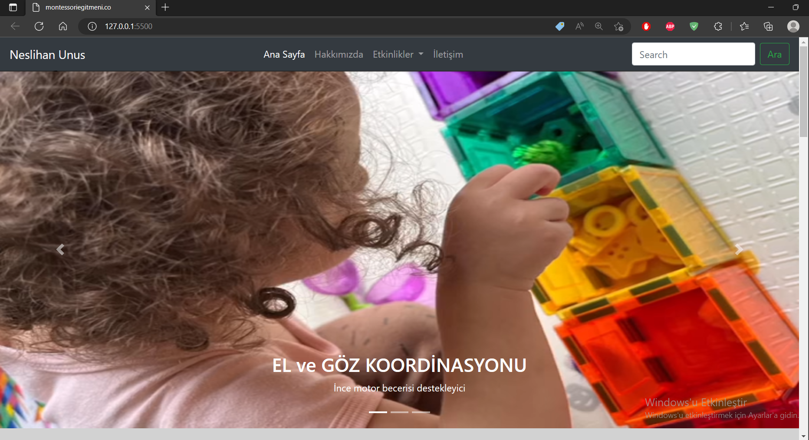
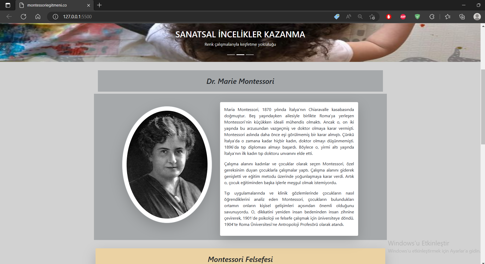
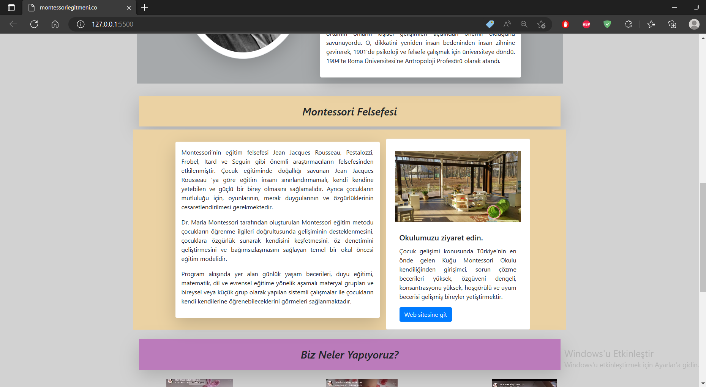
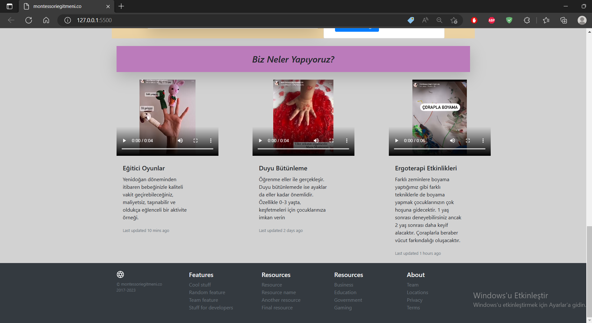
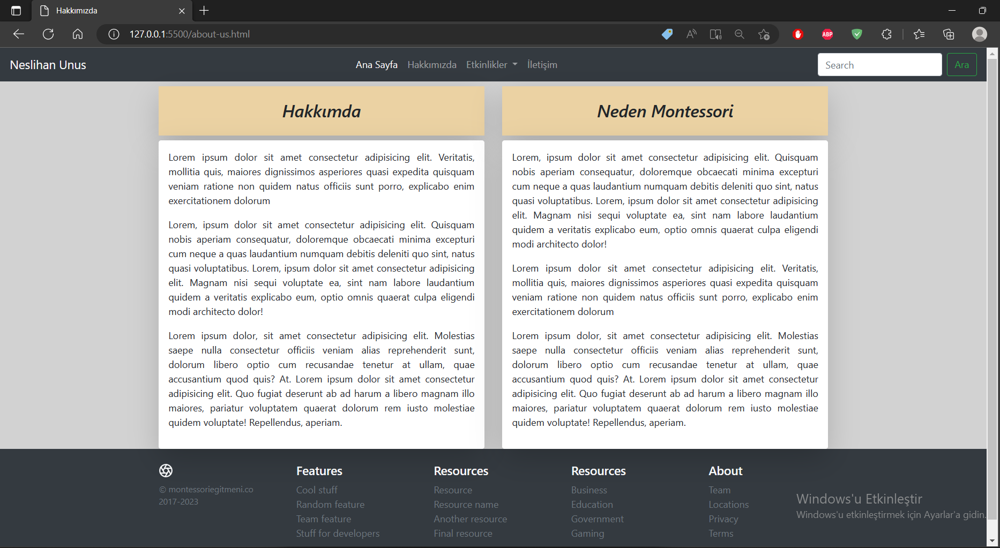
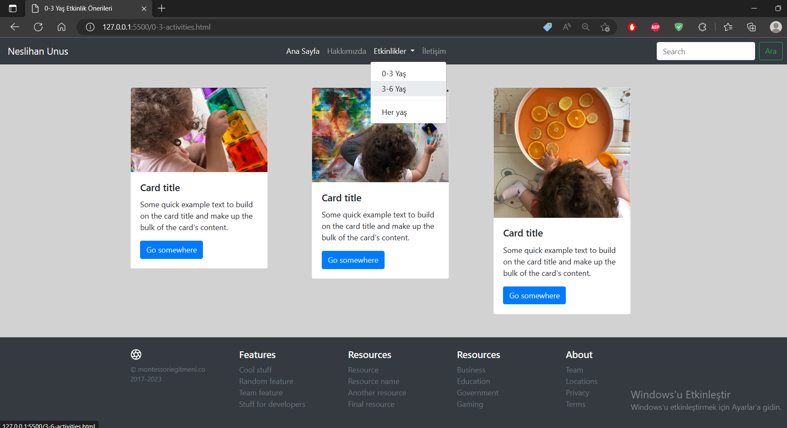
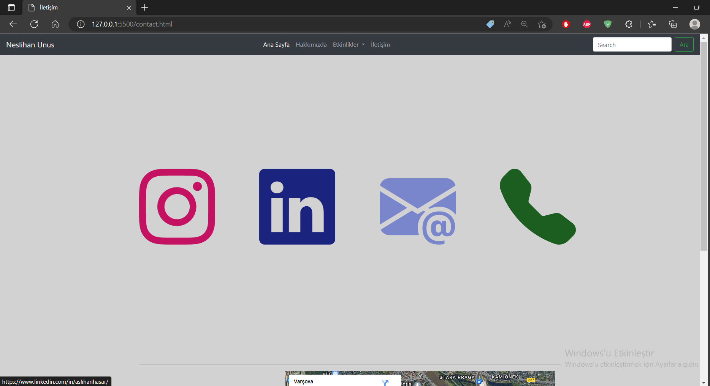
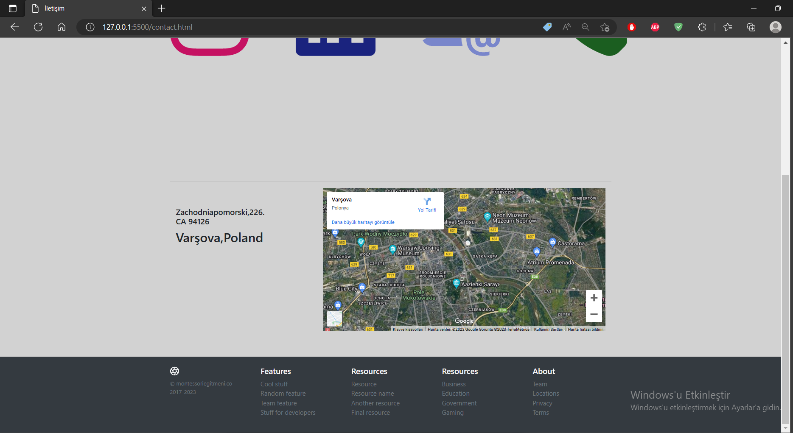
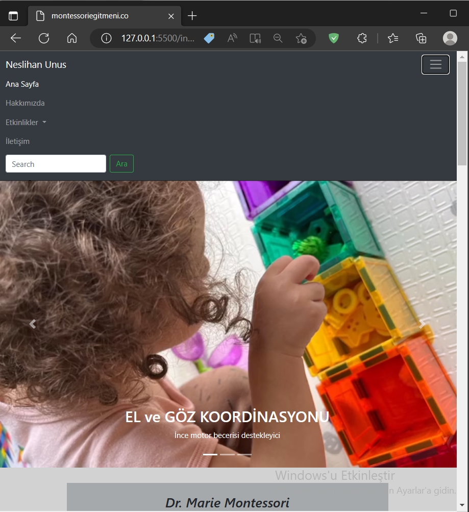

# Web-site

### This project consists of a website design using bootstrap, html and css.

---

## Details
* The website has
    * navbar
    * carousel (sliding bar works)
    * containers,rows,cols
    * contact (instagram,linked-in,mail,phone links and map)
    * footer
  
* The home page :

**Navbar and Carousel :**



**Home-page :**





**Home-page and footer :**




* The about-us page : 



* Activities pages :



* Contact pages :
  




**Responsive side:**



---

## Installation
Clone the project.
> https://github.com/aslihanhasar/my-website.git


---

## Usage
After clone the project use Visual Studio Code. 
You can also open the project by typing the following codes in the terminal.

```
cd my-website
code .
```

---

## Requirements
* Bootstrap v.4.6

---

## Author
**Aslıhan Hasar**

* GitHub: [](https://github.com/aslihanhasar)
* LinkedIn: [aslıhanhasar](https://www.linkedin.com/in/asl%C4%B1hanhasar
  )
* You can watch the video for details: [youtube](https://youtu.be/YnD1rSRnxvs)
---

## Contributing
Contributions, issues, and feature requests are welcome.

---

## License

[MIT](https://choosealicense.com/licenses/mit/)

---

## Show Your Suport
Give me a &#11088; if you like the project.

---

## Acknowledgments
* This repo is created for my project assignments in the Üretken Akademi.
